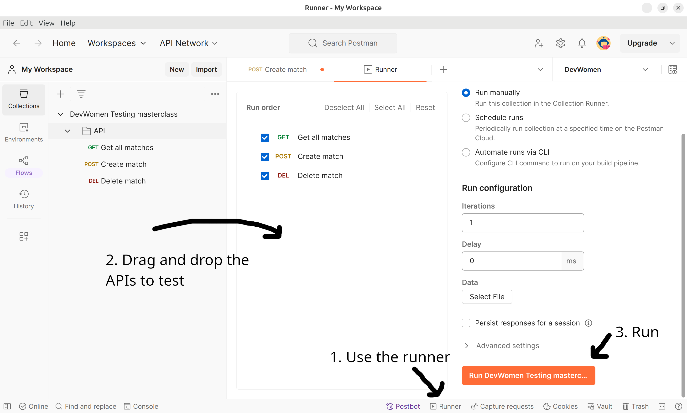

# devwomen testing masterclass

## Setup project

**backend**

```bash
cd backend
npm install
```

**frontend**

```bash
cd frontend
npm install
```

## Run tests

**E2E**

```bash
cd frontend 
npx playwright test --ui
```

**Unit**

```bash
cd backend
npm test
```

**Integration**

Import the postman collection that you can find at `backend` folder named `DevWomen Testing masterclass.postman_collection.json`.

Use the following link to know how to import the collection. https://learning.postman.com/docs/designing-and-developing-your-api/importing-an-api/

Run the test as:



## See Continuous Integration

You can see the Continuous Integration pipelines at [Github Actions tab](https://github.com/aleixmorgadas/devwoman-testing-masterclass/actions)